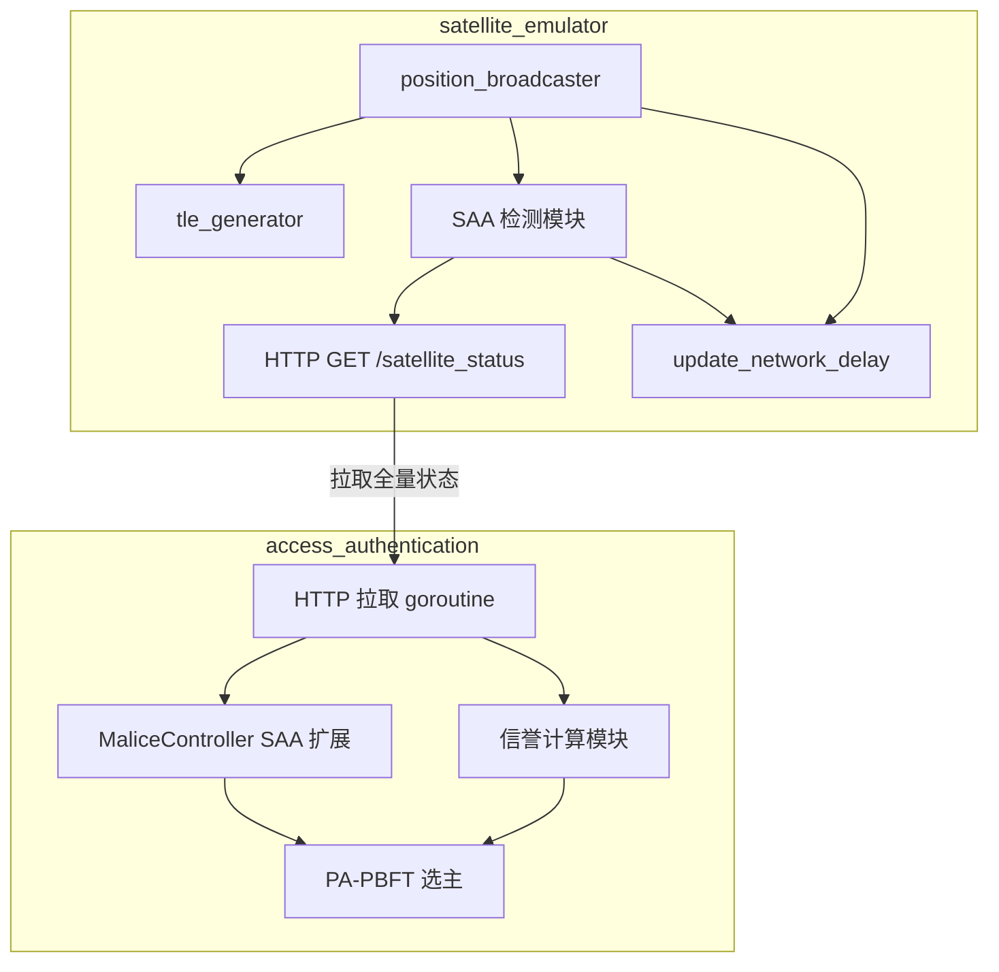
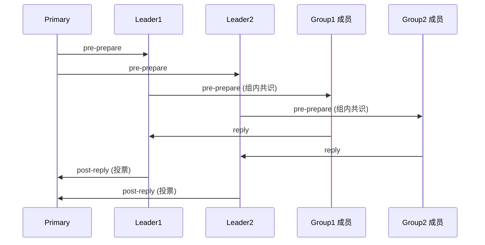

# PA-PBFT SAA 卫星区块链开发计划

## 架构总览




---

## 阶段一：satellite_emulator - SAA 区域与 tc 修改

### 1.1 SAA 区域定义与检测

**新增文件/修改**：

- [position_update/const_var.py](position_update/const_var.py)：新增 SAA 相关常量
  - `SAA_ENABLED`：开关
  - `SAA_LAT_RANGE`：纬度范围 (如 -50, 0)
  - `SAA_LON_RANGE`：经度范围 (如 -80, 20)
  - `SAA_NETWORK_LOSS`：SAA 内 loss（如 "2%"）
  - `SAA_NETWORK_BANDWIDTH`：SAA 内 rate（如 "2Mbps"）
- 新增 [position_update/saa_detector.py](position_update/saa_detector.py)
  - `is_in_saa(lat: float, lon: float) -> bool`：矩形区域判断
  - `get_time_to_saa(node: SatelliteNode, now: datetime, window_sec: float = 10) -> int`：预测进入 SAA 剩余秒数
    - 使用 ephem 按时间步进，找最近进入 SAA 的时刻
    - 10s 内不进入返回 -1，已进入返回 0，否则返回秒数
    - 若轨道永不经过 SAA（如极地轨道），返回 -1
    - 注意：ephem 返回 lat/lon 为弧度，SAA 区域判断前需统一单位（弧度或度）
- [resources/constellation_config.yml](resources/constellation_config.yml)：新增 SAA 配置段

### 1.2 修改 update_network_delay

**修改** [position_update/position_broadcaster.py](position_update/position_broadcaster.py)：

- 在 `update_network_delay()` 中，对每条链路判断 `source` 或 `dest` 是否在 SAA
- 若任一端在 SAA 且 `SAA_ENABLED`，对该链路使用 `SAA_NETWORK_LOSS`、`SAA_NETWORK_BANDWIDTH`
- 否则使用原 `NETWORK_LOSS`、`NETWORK_BANDWIDTH`

### 1.3 SAA 状态存储与更新周期

- `position_broadcast()` 每轮更新后调用 SAA 检测，将各节点 SAA 状态、`time_to_saa`、`remaining_bandwidth`（该节点所有链路 rate 最小值）存入共享结构
- 更新周期与 `UPDATE_INTERVAL`（10s）一致
- `remaining_bandwidth` 计算：遍历 `connection_link`，对每个节点取 min(其所有链路的 rate)；SAA 内链路用 SAA 带宽

---

## 阶段二：satellite_emulator - 算力异构

### 2.1 算力标记

- [position_update/tle_generator.py](position_update/tle_generator.py)：在 `generate_tle()` 中为每个卫星分配算力类型
  - 30% 高性能：`compute_capacity = 1.0`
  - 70% 低性能：`compute_capacity = 0.3`（可配置）
  - 随机分配，结果写入 `position_datas` 或单独 dict。若需实验可复现，可用按 node_id 的确定性分配（如 node_id % 10 < 3 为高性能）

### 2.2 配置

- [resources/constellation_config.yml](resources/constellation_config.yml)：`high_perf_ratio: 0.3`、`low_perf_capacity: 0.3`

---

## 阶段三：satellite_emulator - HTTP 接口

### 3.1 GET /satellite_status

**修改** [visualizer/flask_visualizer.py](visualizer/flask_visualizer.py) 或新建 API 模块：

- 新增 `GET /satellite_status` 接口
- 从共享文件读取（见 3.2 数据共享方案）；position_broadcast 写入，flask 读取
- 返回 JSON 示例（仅保留 accessauth/PA-PBFT 实际使用的字段）：

```json
{
  "nodes": [
    {
      "node_id": "node_0",
      "compute_capacity": 1.0,
      "remaining_bandwidth": 5.0,
      "in_saa": false,
      "time_to_saa": -1
    }
  ]
}
```

- `node_id`：节点标识，用于 accessauth 查表（nodeK → node_(K-1)）
- `compute_capacity`：算力（1.0/0.3），用于算力延迟与信誉 C_i
- `remaining_bandwidth`：该节点所有 ISL 的 tc rate 最小值；SAA 内链路用 SAA 带宽，非 SAA 用原带宽；用于信誉 L_i 与选主
- `in_saa`：当前是否在 SAA 内；用于 MaliceController 与信誉 E_i
- `time_to_saa`：10s 内不进入为 -1，已进入为 0，否则为秒数；用于信誉 E_i

### 3.2 数据共享（关键：跨进程方案）

**现状**：`position_broadcast` 运行在 LeoOrChainGenerator 的子进程中，`flask_visualizer` 由 start_server.py 单独启动，两者不共享内存。

**推荐方案**：文件共享

- 路径：`/tmp/satellite_emulator_status.json` 或 `resources/satellite_status_cache.json`
- `position_broadcast` 每 UPDATE_INTERVAL 写入；使用原子写入（先写 .tmp，再 os.rename）避免读到半写数据
- flask 接口读取该文件；若文件不存在或为空，返回 `{"nodes": []}` 或 503
- 启动顺序：flask 可先启动，position_broadcast 首次写入前 API 返回空/默认值

---

## 阶段四：access_authentication - 状态拉取与 SAA 作恶概率

### 4.1 HTTP 拉取客户端

**新增** access_authentication 项目下 `main/zeusnet/satellite_status_client/satellite_status_client.go` 或扩展现有 http_client：

- 周期性 GET `http://<emulator_host>:<port>/satellite_status`（主机地址可配置）
- **网络注意**：accessauth 运行在 Docker 容器内，emulator 在宿主机。`emulator_status_url` 需为容器可访问的地址（如宿主机 IP、`host.docker.internal`、或 Docker 网桥 IP 172.17.0.1）
- 解析 JSON，按 node_id 建立 `map[string]SatelliteStatus`，存入带 `sync.RWMutex` 的全局缓存
- 将 `node1` 映射为 `node_0`（accessauth nodeK = emulator node_(K-1)）

### 4.2 MaliceController SAA 扩展

**修改** access_authentication 的 `consensus-protocol/consensusglobal/malicecontroller.go`：

- 增加输入：当前节点是否在 SAA（从 satellite_status_client 的全局缓存读取，需传入 nodeId 以查表）
- MaliceController 在每次 rand/sleep 循环迭代前，读取缓存：`if InSAA(nodeId) { use saaMalicePro } else { use maliceProbability }`
- SAA 内：使用 `SAA_MALICE_PRO = 0.1` 决定 `IsMaliciousSatellite`
- SAA 外：沿用原 `maliceProbability`
- 配置：`localconf` 新增 `saa_malice_pro`、`emulator_status_url`

### 4.3 配置

- access_authentication 的 `localconf/types.go`：`SaaMalicePro`、`EmulatorStatusUrl`
- chainmaker.yml：对应字段

### 4.4 算力共识延迟模拟（思路一：协议内延迟）

**目标**：在共识协议内按节点算力模拟「高性能节点共识快、低性能节点共识慢」，使实验能稳定复现算力异构对延迟的影响，并与信誉中的 C_i 一致。

**思路**：在本节点**即将发送**共识消息（prepare/commit/reply/post-reply）之前，根据本节点的 `compute_capacity` 插入一段休眠，再调用发送逻辑。将「算力弱 → 签名/验签/处理慢」抽象为「多等一段时间再发出投票」。

**实现要点**：

1. **延迟公式**
  - `delay_ms = base_delay_ms * (1 - compute_capacity)`
  - 高性能（compute_capacity=1.0）→ 0 ms；低性能（0.3）→ `0.7 * base_delay_ms`
  - 默认 `base_delay_ms = 50`（可配置），便于调参做敏感性分析
2. **compute_capacity 来源**
  - 优先从 satellite_status_client 的缓存读取本节点对应 `compute_capacity`（与 satellite_emulator 的 30%/70% 分配一致）
  - 若未拉取到状态（未配置或网络失败），回退为配置的默认值（如 1.0）或与 tle_generator 一致的确定性规则（如按 NodeId 取模），保证与阶段二算力标记一致
3. **插入位置**（TPBFT/PA-PBFT 共用）
  - 在 access_authentication 的 `consensus-protocol/tpbft/consensus_tpbft_impl.go`（及 PA-PBFT 对应实现）中，每次本节点要**发送**投票时，在调用 `sendConsensusVote(vote)` 之前执行一次 `time.Sleep(computeDelay())`。
  - 具体插入点：`enterPrepare` 末尾、`addVote` 中 `consensus.sendConsensusVote(vote)` 之前（本节点产生 prepare/commit/reply/post-reply 并要广播时）。仅在本节点**主动发送**时加延迟，**接收**或转发他人消息不加。
4. **封装与开关**
  - 新增工具函数：`computeDelayMs(computeCapacity float64, baseDelayMs int) time.Duration`，在 consensus 包或 consensusglobal；若 `computeCapacity <= 0` 或未启用算力延迟则返回 0。
  - 配置项：`localconf` 增加 `compute_delay_enabled`（bool）、`compute_delay_base_ms`（int），chainmaker.yml 对应字段；关闭时恒返回 0。
5. **作用范围**
  - 对 TPBFT、PA-PBFT 均生效（同一套 delay 逻辑），基线协议也体现算力差异，PA-PBFT 通过选主优化在相同环境下表现更优。

**配置**：access_authentication 的 `localconf/types.go` 增加 `ComputeDelayEnabled`、`ComputeDelayBaseMs`；chainmaker.yml 增加 `compute_delay_enabled`、`compute_delay_base_ms`。**默认值**：`compute_delay_enabled: true`，`compute_delay_base_ms: 50`。

---

## PA-PBFT 双层架构说明

PA-PBFT 与 TPBFT 共用同一双层结构：**第二层的 Leader 就是第一层的 Leader**，即每个共识组的 Leader 既是第一层参与 Primary 通信的节点，也是第二层组内共识的发起者。




**消息流**：

1. Primary 发送 pre-prepare 给各 Leader
2. Leader 收到后在本组内发起第二层共识（广播 pre-prepare 给组内成员）
3. 组内成员 consensus 后 reply 给各自的 Leader
4. Leader 收集 reply，将 post-reply 发给 Primary
5. Primary 收集所有 Leader 的 post-reply 完成共识

**PA-PBFT 改造范围**：仅修改**第一层 Leader 的选主逻辑**（信誉 + 带宽）。第二层逻辑完全沿用 TPBFT——第二层 Leader 即第一层 Leader，无需单独选主。

---

## 阶段五：access_authentication - PA-PBFT 信誉与选主

### 5.1 信誉计算模块

**新增** access_authentication 的 `consensus-protocol/papbft/reputation.go`：

- **环境生存因子 E_i（即 δ(i,t)）**，按当前/预测是否进入 RiskZone（如 SAA）分三种情况：
  - 若 **Status(i, t+Δt) ∉ RiskZone**（预测时间窗口 Δt 内不会进入）：E_i = **1**
  - 若 **Status(i, t+Δt) ∈ RiskZone**（预测将进入）：E_i = **e^(-λ(T_risk - t))**，其中 T_risk 为预测进入高危区域的时刻，λ 为风险敏感系数
  - 若 **Status(i, t) ∈ RiskZone**（当前已在高危区域内）：E_i = **0**
  - 实现时用 `time_to_saa`、`in_saa` 映射：已进入 → 0；未进入且 10s 内不进入 → 1；未进入且将在 τ 秒内进入 → e^(-λ·τ)，τ 由 `time_to_saa` 提供
  - **注意**：e^(-λ(T_risk - t)) 在 t→T_risk 时趋于 1；若论文要求“逼近 SAA 时信誉归零”，需与论文公式核对（必要时改为 t 越接近 T_risk 值越小的形式）
- 算力潜能因子 C_i：来自 `compute_capacity`（1.0 或 0.3）
- 通信质量因子 L_i：Sigmoid 映射 `remaining_bandwidth`（无 SNR 时用带宽近似）
- 行为信誉因子 B_i：时间窗口内有效投票率，双花/分叉则置 0。**MVP 阶段**：若现有系统无双花/分叉检测，B_i 可简化为有效投票率，或暂时固定为 1.0
- **动态信誉融合**：**R_i = E_i × (w_1 C_i + w_2 L_i + w_3 B_i)**，其中 w_1 + w_2 + w_3 = 1。默认 w_1=0.35, w_2=0.40, w_3=0.25（见下方默认值表）。E_i 为环境门控，在 SAA 内或逼近时使信誉降为 0 或接近 0；其余为资源与行为加权和

### 5.2 PA-PBFT 第一层选主（第二层 Leader 同第一层）

**新增** access_authentication 的 `consensus-protocol/papbft/consensus_papbft_impl.go`：

- 复制 TPBFT 结构，仅修改第一层 leader 选择逻辑
- 第一层选出的 Leader 即第二层组内 consensus 的 Leader，无需额外选主逻辑
- 替换 TPBFT 的 `setFirstLayerLeaderNodes`：
  - 每组：按信誉排序，取 Top3 进候选池
  - 候选池中选 `remaining_bandwidth` 最大者为该组 leader
  - 若当前 leader 在候选池中，且相对带宽差 |bw_new - bw_old| / bw_old \le \sigma，则不切换（默认 σ=0.15，即 15%）
- **选主触发时机**：每次 satellite_status_client 拉取到新数据时重新计算；或至少每 N 秒（如 10s）刷新一次
- **remaining_bandwidth 定义**：节点有多条 ISL，取该节点所有链路的 tc rate 最小值（瓶颈）；SAA 内链路用 SAA 带宽，非 SAA 用原带宽

### 5.3 信誉值 = 0 的处理（风险：实现复杂）

- 信誉为 0：节点退出共识组，变为普通节点（不参与 prepare/commit/reply）
- 恢复条件：信誉超过阈值且持续若干轮后，重新加入共识组
- **MVP 简化**：ValidatorSet 来自配置，动态排除需改协议层。建议 MVP 阶段暂不实现「信誉=0 退出」，或仅做本地标记（该节点自视为不可参与投票），不改变 GroupValidators；后续再考虑广播排除或协议扩展

### 5.4 共识协议注册

- 在 access_authentication 的 `localconf/global.go` 增加 `ConsensusType_PAPBFT = 3`
- 在 `main/component_registry.go` 注册 PA-PBFT Provider
- chainmaker.yml：`consensus_protocol_type: 3` 选择 PA-PBFT

---

## 阶段六：集成与配置

### 6.1 配置文件汇总


| 层级                    | 文件                              | 新增配置                                                                                                                                                       |
| --------------------- | ------------------------------- | ---------------------------------------------------------------------------------------------------------------------------------------------------------- |
| satellite_emulator    | constellation_config.yml        | saa_enabled, saa_lat_range, saa_lon_range, saa_loss, saa_bandwidth, high_perf_ratio, low_perf_capacity                                                     |
| satellite_emulator    | const_var.py                    | 上述 SAA/算力常量                                                                                                                                                |
| access_authentication | chainmaker.yml                  | saa_malice_pro, emulator_status_url, pa_pbft_sigma, reputation_weights, consensus_protocol_type: 3 (PA-PBFT), compute_delay_enabled, compute_delay_base_ms |
| access_authentication | localconf                       | 对应结构体字段                                                                                                                                                    |
| access_authentication | configutils/generateymlfiles.go | 支持 consensus_protocol_type: 3                                                                                                                              |


### 6.2 node_id 映射

- satellite_emulator / constellation：`node_id` 为 0-based 整数，HTTP 返回 `node_0`, `node_1`, ...
- access_authentication：config 中 `node1`, `node2`, ... 对应 consensus_node0, consensus_node1
- 映射规则：accessauth `nodeK` = emulator `node_(K-1)`（即 node1 → node_0，node2 → node_1）
- 来源：constellation satellites 的 node_id 与 tle_generator 的卫星索引一致

---

## 风险与漏洞清单（开发前必读）


| 风险项      | 说明                                   | 处理方式                         |
| -------- | ------------------------------------ | ---------------------------- |
| 跨进程数据共享  | position_broadcast 与 flask 不同进程      | 使用文件共享 + 原子写入                |
| 容器访问宿主机  | accessauth 在 Docker 内拉取 emulator API | emulator_status_url 需为容器可达地址 |
| 信誉=0 退出  | 动态排除节点需改 ValidatorSet                | MVP 暂不实现或仅本地标记               |
| 行为信誉 B_i | 双花/分叉检测可能不存在                         | MVP 用有效投票率或固定 1.0            |
| ephem 弧度 | SAA 区域判断需统一坐标单位                      | 弧度转度或 SAA 边界用弧度              |
| 选主触发时机   | 何时重新计算 Leader                        | 每次状态拉取或至少每 10s               |
| 启动顺序     | flask 先于 position_broadcast          | API 在无数据时返回空/503             |


---

## 依赖与顺序


---

## 关键文件索引


| 模块       | 路径（satellite_emulator 为本仓库；access_authentication 为另一仓库） |
| -------- | ----------------------------------------------------------------- |
| SAA 检测   | position_update/saa_detector.py（新建）                              |
| 位置与 tc   | position_update/position_broadcaster.py                            |
| 常量       | position_update/const_var.py                                     |
| TLE/算力   | position_update/tle_generator.py                                  |
| HTTP API | visualizer/flask_visualizer.py                                     |
| 拉取客户端    | access_authentication：main/zeusnet/satellite_status_client（新建）     |
| 作恶概率     | access_authentication：consensus-protocol/consensusglobal/malicecontroller.go |
| PA-PBFT  | access_authentication：consensus-protocol/papbft/（新建目录与实现）           |
| TPBFT 选主 | access_authentication：consensus-protocol/tpbft/setTPBFTImplField.go        |
| 算力共识延迟   | access_authentication：consensus-protocol/tpbft/consensus_tpbft_impl.go 等  |


---

## 默认值（面向 PA-PBFT 性能优化，可后续调参）

以下取值在保证稳定性的前提下，偏向选主质量与 SAA 规避，便于在实验中体现相对 TPBFT/PBFT 的性能优势。


| 参数                   | 默认值                        | 说明                                                           |
| -------------------- | -------------------------- | ------------------------------------------------------------ |
| SAA 区域               | lat [-50, 0]，lon [-80, 20] | 与文献一致                                                        |
| time_to_saa 窗口 Δt    | 10s                        | 与 position 更新周期一致                                            |
| 信誉权重 w_1, w_2, w_3   | 0.35, 0.40, 0.25           | 算力、通信、行为；略提高通信权重利于选高带宽 Leader                                |
| 风险敏感系数 λ             | 0.15                       | E_i = e^(-λ·τ)，τ 为进入 SAA 剩余秒数；λ=0.15 时约 7s 前 E_i≈0.35，利于提前降权 |
| σ（带宽差阈值）             | 0.15                       | 相对差                                                          |
| SAA 内作恶概率            | 0.10                       | 默认 10%                                                       |
| SAA 内链路 loss / rate  | 2%，2Mbps                   | 相对正常 0%、5Mbps 有明显劣化                                          |
| 高性能节点比例 / 低性能算力      | 0.30，0.30                  | 30% 高性能，70% 低性能 C_i=0.3                                      |
| 高性能算力 C_i            | 1.0                        | 与配置一致                                                        |
| 算力共识延迟 base_delay_ms | 50                         | 低性能节点发投票前多等 50×(1-0.3)=35ms；可关可调                             |


**性能取向简述**：提高 w_2（通信）使带宽大的节点更易被选为 Leader，降低时延；λ=0.15 使逼近 SAA 的节点信誉较快下降，减少“即将进 SAA 的节点”被选为 Leader；σ=0.15 在避免频繁切换的同时仍允许在带宽差距较大时切换，兼顾稳定与优化。
